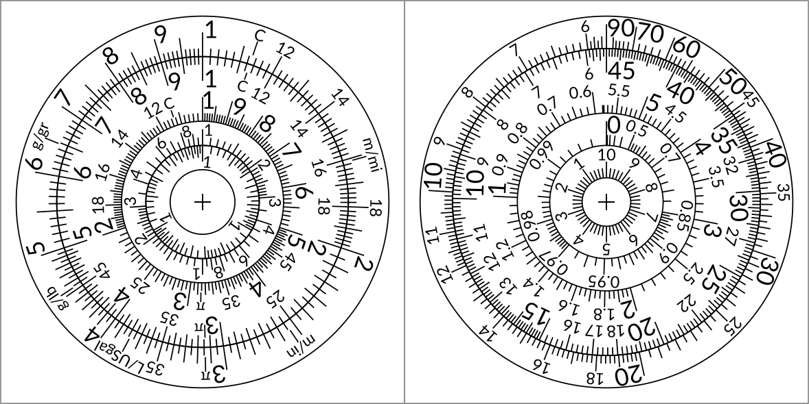

# slide-rule-scales
This is a Python library for creating completely customisable slide rule scales. 

## Visual Example

A set of front and back circular slide rule scales created using multiple outputs from scripts using this library.

## Required Python libraries

[NumPy](https://anaconda.org/anaconda/numpy) `pip install numpy`  
[pandas](https://anaconda.org/anaconda/pandas) `pip install pandas`  
[svgwrite](https://anaconda.org/omnia/svgwrite) `pip install svgwrite`  

## Folder structure

```
SlideRuleScales/
├─__init__.py <--------------
├─SlideRuleScale.py <--------
├─scale.py
└─scale_dir/
  ├─scale_specs_dir/
  │ ├─draw_specs.csv
  │ └─scale/ <---------------
  │   ├─Core.csv <-----------
  │   ├─x-y.csv
  │   ├─y-z.csv
  │   └─one-offs.csv <-------
  └─scale.svg
```
"<---" Indicates fixed names.
All other names may be changed, together with their references.
x, y and z are numbers. More details below.

## Scale specs files structures

- 1-Core.csv has an exclusive column with the following description:
  -                name - Number that names each core position.
                          These are the positions where there is a change on the behavior of the scale.
                          Each interval among two of these positions (x and y) must have a scale specification file "x-y.csv"

- x-y.csv has an exclusive column with the following description:
  -            interval - Number that specifies the interval between two consecutive lines at the scale.
                          Counting starts at the first number (x).
                          Applying the first lines of the table first and applying only once per position.

- one-offs.csv has exclusive columns with the following descriptions:
   -               name - Text that names the one-off.
                          If the name does not exist, it is added.
                          If the name already exists, it is replaced with the new configuration.
                          The format of generated names is: 5 decimal places with no trailing zeros or point.
   -           position - Position that the one-off is to be drawn.

- 1-Core.csv, x-y.csv and additions.csv have common columns with the following descriptions:
  -      l_position_tip - Tip of the line position (where the text is applied) for each position.
  -     l_position_base - Base of the line position (generally 0) for each position.
  -             l_width - Width of the line for each position.
  -              t_font - Font family of the text. Only if text is desired. Example: sans-serif.
  -              t_size - Size of the text for each core position. (3.175mm = 9pt PostScript)
  -            t_anchor - svg standard for anchoring the text: start, middle or end.
  -        t_position_x - Offset of the text anchor position in relation to the line's tip in the horizontal direction.
  -        t_position_y - Offset of the text anchor position in relation to the line's tip in the vertical direction.
  -             t_angle - Angle of the text. 0° represents left to right text labelling a bottom to top line.
All sizes are in mm, and angles in degrees. Text properties (starting with t_) should be left blank when no text is desired.

## Draw specs file structure

- When drawing a straight scale, draw_specs.csv has exclusive columns with the following description:
  -        paper_size_x - Size of the paper in the horizontal direction.
  -        paper_size_y - Size of the paper in the vertical direction.
  -        scale_size_x - Length of the scale (always horizontal).
  -      scale_origin_x - Position of the start of the base line of the scale in the horizontal direction.
  -      scale_origin_y - Position of the start of the base line of the scale in the vertical direction.
  -       mark_origin_y - Position of the extra mark line, parallel to the base line of the scale.

- When drawing a circular scale, draw_specs.csv has exclusive columns with the following description:
  -          paper_size - Size of the side of the square paper.
  -        limit_radius - Size of the limit circle. Usually outside, the size of the rule itself.
  -        scale_radius - Size of the base circle of the scale.
  -         mark_radius - Size of the extra mark line.
  -     centermark_size - Size of the cross that marks the center of the circles.

- When drawing either a straight or a circular scale, draw_specs.csv has columns with the following descriptions:
  -          line_width - Width of the lines that are drawn as basis for the scale (excludes position lines).
  -         strip_zeros - Whether the trailing zeros should be removed or not before writing the numbers. 400 would become 4.
All sizes are in mm.

## Standard scale.py file structure

### Header
```
from SlideRuleScale import SlideRuleScale
import os
os.chdir("./scale_dir/")
```

### Object manipulations:
```
                 Initialization - Scale = SlideRuleScale("./scale_specs_dir/scale/")
             Scale type setting - Scale.set_scale_type(scale_type, invert_scale=0, positioning_factor=1, log_base=10)
                                  scale_type: scale types (Mannheim based). Such as A, B, C, D, K, ST, S, T, P, L.
                       (optional) invert_scale: whether the scale should be inverted or not, such as in the CI scale.
                       (optional) positioning_factor: adjusts the position of the scale. Usually a multiple of log_base.
                       (optional) log_base: the base of the logarithm. Base 10 for the decimal number system.
Exporting svg of straight scale - Scale.draw_straight("./scale.svg", "./scale_specs_dir/draw_specs.csv")
Exporting svg of circular scale - Scale.draw_circular("./scale.svg", "./scale_specs_dir/draw_specs.csv")
```
